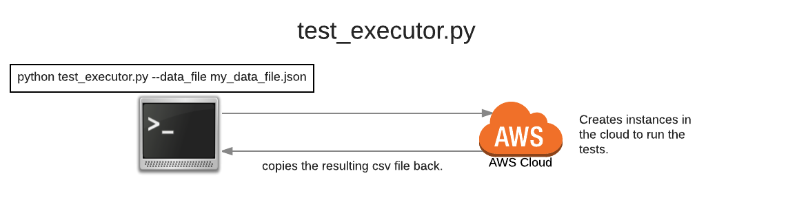
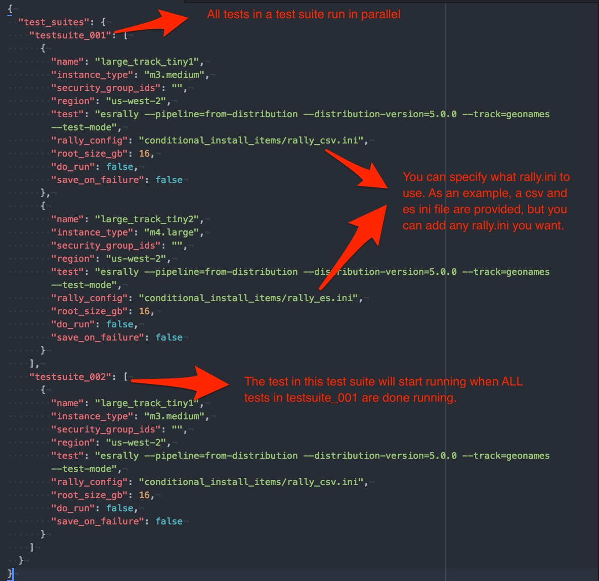

# README.md:

### Purpose of the script:

* The script creates a bare-bones machine in AWS, installs and runs rally, and collects the results of rally.

* You can run this script from anywhere, as long as the AWS CLI is installed AND you have the correct AWS credentials.
  * See below on more details on AWS credentials.

In a nutshell, this is what the script does:

* The script will create an instance from a "golden/bare-bones AMI".

* The script will then copy a script to the bare bones machine that:
  * Installs rally
  * Installs java 8 SDK
  * Runs rally and collect the results.
  * Terminates the instance upon completion.

* The script has 1 required input:
  * The data_file.json file which describes what tests to run in parallel.
  * The provided data_file.json is only an example on what yours should look like.

* What runs in parallel:
  * Every test suite runs in serial, but every test in a test suite runs in parallel.

### How to Run:
```
python test_executor.py --data_file [YOUR_DATA_FILE.json]
```
There is an example data_file.json included.
The following entries need to be tweaked by the user:
* security_group_ids: The security group ID to use to launch the instance with.
* rally_config: What rally config to use. The zip includes a few examples:
  conditional_install_items/rally_es.ini (used to send output to an ES endpoint.)
  conditional_install_items/rally_csv.ini (used to send output back to caller as a csv file.)

For more options, see:
```
python test_executor.py -h
```

This is what the script is doing, in a nutshell:



### Prerequisites:

* python 2.7 or above
* pip install awscli
* AWS Access (see Section on AWS Credentials for more details)

### AWS Credentials:
There are various ways to setup your AWS credentials for this script to work:
* Access Keys as ENV vars::
AWS_ACCESS_KEY_ID
AWS_SECRET_ACCESS_KEY
optionally AWS_SESSION_TOKEN, if your AWS credentials are dynamically generated

* If running on an EC2 instance, the script will use the IAM Roles

* Saved in ~/.aws/config, which the AWS CLI tool uses: http://docs.aws.amazon.com/cli/latest/topic/config-vars.html

### data_file.json options:

All tests are data driven.  Here is a brief description of what the data_file.json:


Once you are happy with your data_file.json, you can start adding more and more tests.
If you have an ElaticSearch cluster that the test instances can reach, you can tweak (or add your own!) rally.ini file with the endpoint of your elasticsearch endpoint.  
